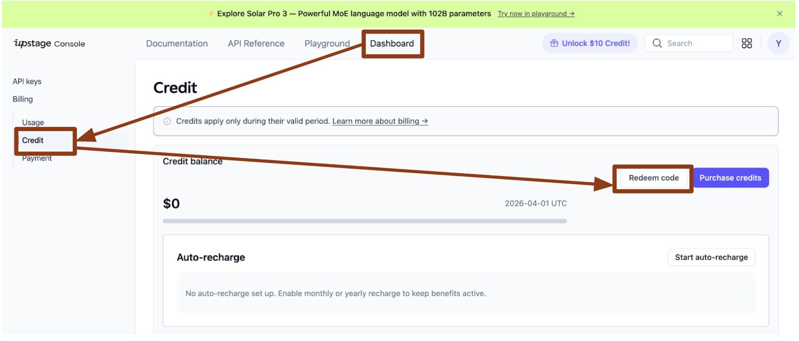

# JNU × Upstage Skillthon

> **전남대학교 소프트웨어중심대학 × 업스테이지**
> 2026 교내 디지털 경진대회 (SW부문) — AI Agent를 위한 Skill 개발

[](https://opensource.org/licenses/MIT)
[](https://upstage.ai)
[](https://claude.ai/code)

---

## 목차

1. [Skillthon이란?](#skillthon이란)
2. [크레딧 지원 — $70 무료 제공](#크레딧-지원--70-무료-제공)
3. [사전 요구사항](#사전-요구사항)
4. [시작하는 방법](#시작하는-방법)
5. [사용 예시](#사용-예시)
6. [제출 구성](#제출-구성)
7. [평가 기준](#평가-기준)
8. [문의](#문의)

---

## Skillthon이란?

**하나의 명확한 Skill을 만드는 대회**입니다.

만든 Skill은 IITP 본선에서 Agent Service의 핵심 부품(module)이 됩니다.

```
Upstage 교육 (5/8)
    → Skillthon 제출 (5/11~15)
        → IITP 본선 Agent Service 확장
```

Agent Skill이란 단일 목적의 모듈로, Upstage Solar API를 활용해 라이프스타일 문제 하나를 해결합니다.
- 명확한 Input / Output 인터페이스
- `run(input_data: dict) -> dict` 한 함수로 완결
- 다른 Agent에 조립·재사용 가능한 구조

---

## 크레딧 지원 — $70 무료 제공

대회 참가자 전원에게 **Upstage API 크레딧 $70**을 무료로 지원합니다.

### 크레딧 받는 방법

1. **[developers.upstage.ai](https://developers.upstage.ai)** 에 회원가입 / 로그인
2. 상단 **Dashboard** 탭 클릭
3. 좌측 메뉴 **Billing → Credit** 클릭
4. 우측 **Redeem code** 버튼 클릭



5. 아래 코드를 입력하고 확인

```
UPWAVE-KOH
```

> **$70 크레딧이 즉시 적립됩니다.** (유효기간: 2026-04-01 UTC)

---

## 사전 요구사항

| 도구 | 버전 | 비고 |
|------|------|------|
| [Claude Code](https://claude.ai/code) | 최신 | 스킬 로드 및 개발 환경 |
| Python | 3.9 이상 | 스킬 실행 및 검증 |
| Git | — | 저장소 Fork & Clone |
| Upstage API 키 | — | [크레딧 지원](#크레딧-지원--70-무료-제공) 참고 |

---

## 시작하는 방법

### 1단계 — 이 repo를 Fork

GitHub 우측 상단 **Fork** 버튼 클릭

### 2단계 — Fork한 repo를 Claude Code로 열기

```bash
git clone https://github.com/[내-username]/JNU-Upstage-Skillthon
cd JNU-Upstage-Skillthon
claude .
```

### 3단계 — skill-creator 스킬 로드

```bash
claude skills add skills/skill-creator
```

### 4단계 — Upstage API 키 설정

1. [크레딧 지원 방법](#크레딧-지원--70-무료-제공)으로 $70 크레딧 수령
2. API 키 발급: [console.upstage.ai](https://console.upstage.ai) → API Keys
3. `.env` 파일 생성:

```bash
# .env 파일에 발급받은 API 키 입력
echo "UPSTAGE_API_KEY=your-api-key-here" > .env
```

### 5단계 — 스킬 만들기

Claude Code에서 skill-creator가 단계별로 안내합니다.

```
> 새 Skillthon 스킬을 만들고 싶어요
```

완성된 스킬이 repo 루트에 생성됩니다.

## 사용 예시

### 스킬 검증

제출 전 반드시 검증 스크립트를 실행하세요:

```bash
python skills/skill-creator/scripts/quick_validate.py [내-스킬-이름]
```

**✅ 검증 통과 예시:**

```
✅ SKILL.md  — name, description 확인
✅ skill/main.py  — run() 함수, UPSTAGE_API_KEY, upstage.ai base_url 확인
✅ requirements.txt  — 의존성 확인
✅ README.md  — 6개 섹션 확인
✅ .gitignore  — API 키 노출 방지 확인
```

## 제출 구성

Fork된 repo 안에 다음 구조가 있어야 합니다:


> **주의:** `skills/` 디렉터리는 수정하지 마세요.
> `.env` 파일은 절대 커밋하지 마세요 (API 키 노출).


## 문의

- **담당:** 조아라 연구원, 고범수
- **전화:** 062-530-5364,010-4012-1143
- **이메일:** [sunan4711@jnu.ac.kr](mailto:sunan4711@jnu.ac.kr), [gobeumsu@gmail.com](mailto:gobeumsu@gmail.com)
